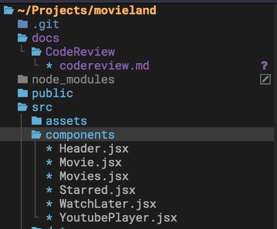
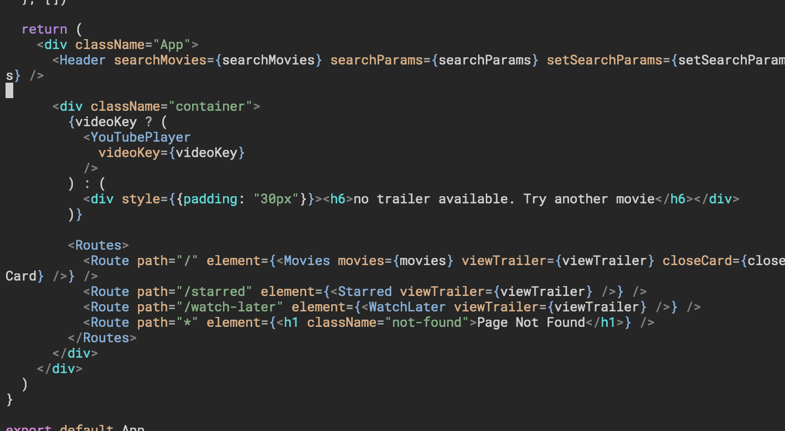
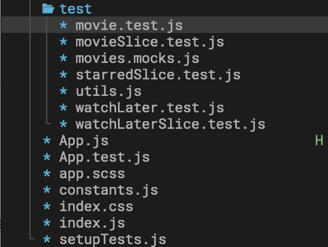
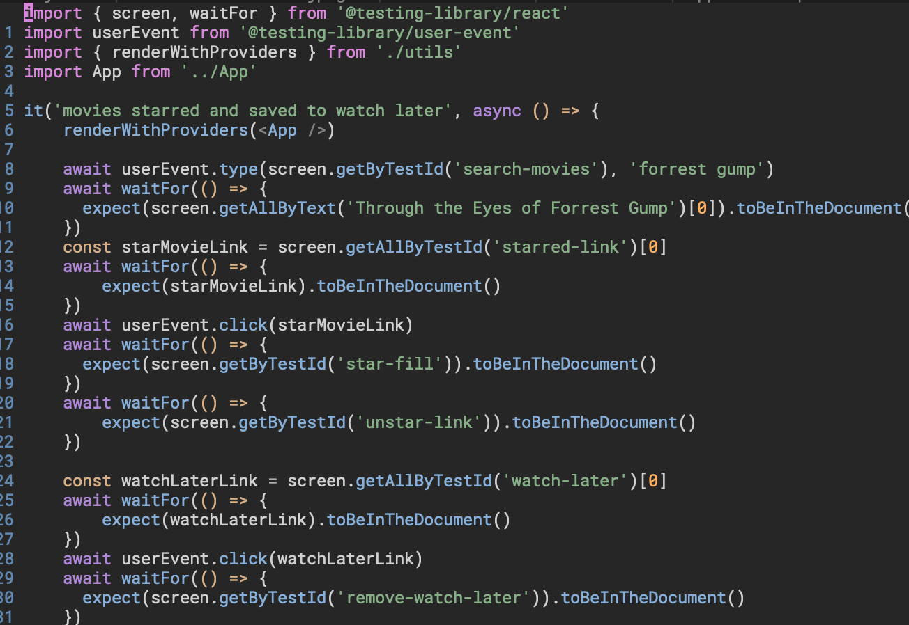
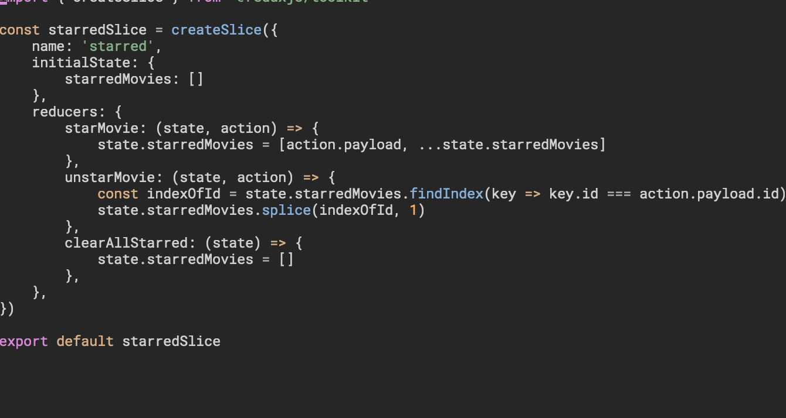
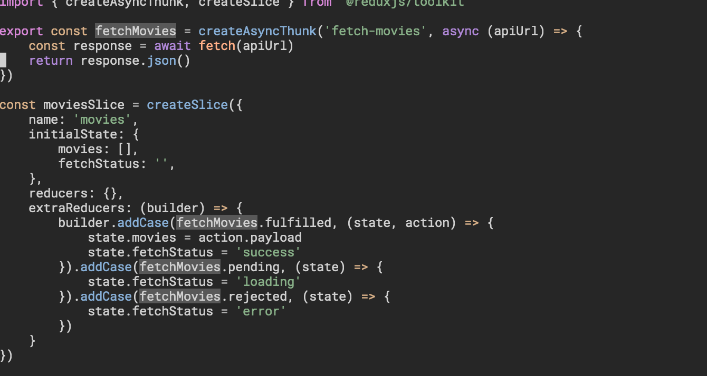

Code Review

## General

- It would be worth considering using PropTypes or a [TypeScript preset when using Create React App](https://create-react-app.dev/docs/adding-typescript/). TypeScript has many benfits, such as offering [Static Typing](https://en.wikipedia.org/wiki/Type_system#STATIC) and [Intellisense](https://en.wikipedia.org/wiki/Intelligent_code_completion), with organisations such as Airbnb [claiming the use of TypeScript could have reduced the prevalence of bugs by 38%](https://www.infoq.com/news/2020/08/airbnb-typescript-migration/)
- in `Movie.jsx` you are importing the placeholder image from the `assets/` folder. However, typically when using a create-react-app preset, assets are usually stored in the `public/` folder. Consider moving your assets here and using the `src` attribute (i.e. `src="./images/not-found.jpg"`).
- In `constants.js`: Do not commit secrets to our repository. The API key should be stored in a `.env` file that is ignored via our `.gitignore` file.
- In `constants.js`: For your endpoints, it might be cleaner to use template literals instead of concatenating strings. You might also consider exporting this as an object or enum (i.e. `ENDPOINTS`) so there is only one import required, and specific endpoints can be used with dot notation such as `ENDPOINTS.DISCOVER`.
- Consider looking into adding pre-commit hooks. We might use this to ensure all tests are passing before commiting, and also applying linting and prettier fixes too.
- In `App.js`: It's probably better to create a modal as a re-usable component - possibly controlled by its own hook. That way, the styling and logic won't need to be re-created. This might prevent code duplication as there are a number of accessibility concerns tied with modals that need to be accounted for. These include needing to create a focus-trap, ensuring that it can be closed via keyboard and that the previously focussed item is focussed on when the modal is closed.
- In `App.js`: `viewTrailer()` seems to call `setOpen()` twice regardless if there is a `videoKey`.

## Project Structure

Consider adopting a structure for components where all related files can all be grouped in a single folder. Having all related files grouped in a single folder will improve readability (See: Component-Scoped Styles and CSS Modules). You could then have a single default export from an `index.js` file.

It would improve readability if some of the common layout components were moved to their own Higher Order Component (i.e. the header and page layout could be moved to a HOC, which can be used in the App.js or even index.js component along with the Redux and Route provider). 

Alternatively, an atomic design structure could even be adopted [as seen here](https://andela.com/insights/structuring-your-react-application-atomic-design-principles/).

Similar to the above point about storing your components in their own folder, tests should be moved to their own folder in the component root (i.e. `__tests__`), as this will also improve readability. This structure could also be applied for tests within the Redux store.

### Other Points

- Consider creating a `Core` folder, for storing things such as types and constants.
- `Starred.jsx` and `WatchLater.jsx` seem to be more-or-less the same structure - what if we created a single component for displaying movies that could be re-used instead? This is in-line with the recommendations in the React docs to opt for composability when creating components. The `movies` array could be passed as a prop. We could even have additional props for the no movies message and title as React Nodes.

## Linting/Prettier

- Consider using an eslint plugin such as [sort-imports](https://eslint.org/docs/rules/sort-imports) and [eslint-plugin-import](https://github.com/import-js/eslint-plugin-import). This will automatically sort your import declarations when linting. 
- Consider setting up Prettier for this project for code formatting. This will enforce a consist code style throughout the repository. The Airbnb preset is very popular.

## Styling

- Adding to the point above about CSS Modules, it's better to ensure styles are scoped to a specific component. This could cause issues with styles being overrided such as if there are numerous `button`, `p`, `span` element stylings.
- `max-width` is used a lot for media queries. Ideally, a 'mobile-first' approach should be taken. You begin by writing styles for the smallest viewport (Mobile), and from there add additional `min-width` media queries for each viewport bigger than mobile such as tablet and desktop. In many cases, you write less css using this approach, by only adding styling for properties in viewports larger than the smallest rather than having to re-write properties for each media query.
- In `app.scss` you should use `100vh` for min-height instead of `850px`. This means that it will take up 100% of the initial body height of the viewport. This will allow the body to grow if necessary to take up the remaining height.
- In `App.js`: you seem to be mixing styles by using inline styls as well (`style={{padding: "30px"}}`). It's generally not a good idea to mix methods of applying styling as it will get confusing down the line.
- Try to have a consistent approach for naming classes - ideally hypthens should be used for separating words. Don't mix this with underscores.
- Consider using [BEM](https://getbem.com/) for writing styles. This makes stylesheets much easier to read, and this is especially vital when working on larger projects as this will quickly get out of hand not having an organised structure for styles.
- In addition, consider using a consistent approach for units. Consider using REM instead of px, and be careful with the use of percentages. Ideally, percentages are usually best used for positioning (Such as centering with `left: 50%; transform: translateX(-50%);` or applying max/min-width).
- Try to ensure the use of `z-index` is well documented throughout the application, or create a mixin for applying this property so it can be referenced later. This should be done in large projects to prevent issues, such as overlapping between a modal and navbar using the `z-index` property.
- The majority of the time, Flexbox is the best way of positioning elements in a container.

## Testing

- Consider writing your tests using a [Behaviour-Driven-Development (BDD)](https://revelry.co/insights/development/behavior-driven-development-bdd/) or [Gherkin](https://cucumber.io/docs/gherkin/reference/) approach. You could have a `describe()` block, giving context for the case that is being tested (GIVEN), another `describe()` block specifying the behaviour (WHEN) and finally an `it()` block describing the expected result (THEN). There are many libraries available to enforce styles like this such as [Jest Cucumber](https://www.npmjs.com/package/jest-cucumber). This will assist in writing tests that are easily readible and ensure the criteria for User Stories is met.

### Other Points

- `renderWithProviders(<App />)` is being re-used in each test case. It's better to move this to a `beforeEach()` block of its own to avoid repetition.
- `App.test.js` needs to use the file extension `.jsx` instead. This is required for React components using JavaScript XML. We are rendering React components for this test so it will be needed here.

## Redux

It seems that `unstarMovie()` and `removeFromWatchLater()` both use more-or-less the same implementation logic. To make our application [DRY](https://en.wikipedia.org/wiki/Don%27t_repeat_yourself), you may consider making a re-usable helper function (Stored in the Redux store folder as `utils.js`).

Consider moving this thunk to its own separate file. Further, the fetch request should probably be moved to its own folder as well such as `api` or `services`.

Alternatively, you might even consider using [RTK Query](https://redux-toolkit.js.org/rtk-query/overview). You can create a base query function (Which is just a `fetch()` wrapper). RTK Query will deal with the `pending`, `fulfilled` and `rejected` states as it handles data fetching out of the box, meaning you don't need to create additional reducers, and it even generates a hook that will return `data`, `isLoading` and `error` states (Meaning you won't need to use a selector). On top of this, with no additional configuration, it will setup caching out of the box.

### Other Points

- If you decide to use TypeScript, the RTK docs have guidance to add typings for `useSelector` and `useDispatch` to become `useAppSelector` and `useAppDispatch`. This means we will have typings for the contents of our store.
- Consider adding exports for your slice's actions from the same file - this will mean you can import them directly in a file rather than importing the slice itself.
- In `App.js`: there is additional logic for what is returned via selector that can be [handled by the reducer itself](https://redux.js.org/style-guide/#put-as-much-logic-as-possible-in-reducers). Also, consider using a [Feature Folder](https://redux.js.org/style-guide/#structure-files-as-feature-folders-with-single-file-logic) approach when creating slices/reducers.
- In `App.js`: `getMovie()` and `getMovies()` are making fetch calls using state. There should be a separation of concerns. This should be handled via a thunk and reducer, and should only happen when being called by dispatching an action.
